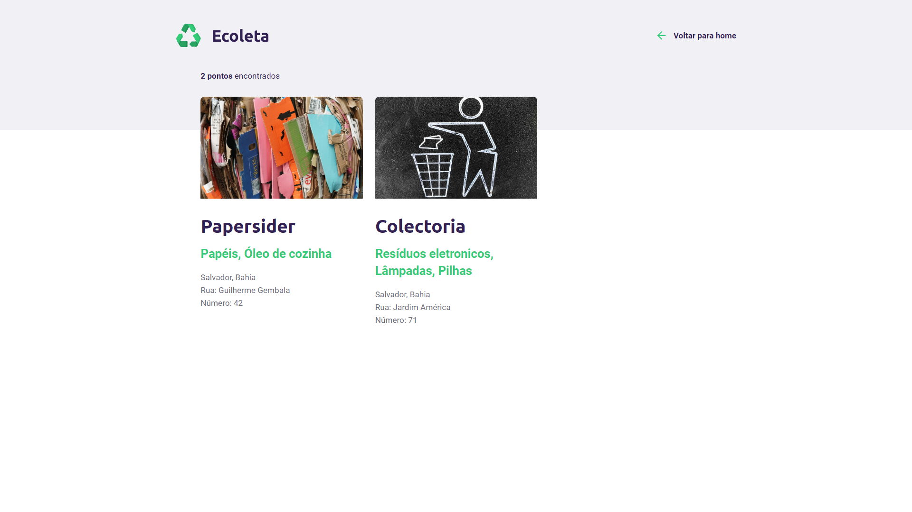
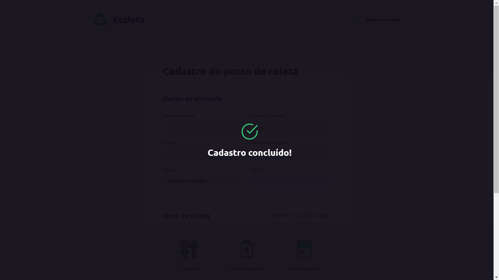

<h1 align="center">
    
</h1>
<h2 align="center">
   ♻️ NextLevelWeek 1.0 ♻️
</h2>

<p align="center">
  
  
  <a href="https://github.com/GabrielReira/Ecoleta-Project/commits/master">
    
  </a>
  <a href="https://github.com/GabrielReira">
    
  </a>
  <a href="https://github.com/GabrielReira/Ecoleta-Project/blob/master/LICENSE.md">
    
  </a>
</p>

<br>

---

## 💻 Sobre o projeto
<p>Ecoleta é uma aplicação web que ajuda pessoas a encontrar pontos de coleta de resíduos recicláveis. A partir de um website é possível realizar buscas de cidades com pontos de coleta e até mesmo fazer o cadastro de alguma localidade que faça coleta de diversos produtos para reciclagem.</p>
<p>Projeto desenvolvido na trilha <strong>Starter</strong> da <strong>Next Level Week</strong> organizada pela <a href="https://rocketseat.com.br/">Rocketseat</a>.</p>
<p>Esta aplicação foi realizada em um padrão de arquitetura de software <strong>full MVC</strong>, com o front-end e back-end na mesma aplicação.</p>

---

## 🚀 Tecnologias utilizadas
### Front-end
* HTML
* CSS
* JavaScript
* Nunjucks

### Back-end
* Node.js
* Express.js
* Nodemon
* npm
* SQLite

---

## 🖼 Screenshots
<h1 align="center">
    
</h1>

<h1>
    
    
</h1>

<h1>
    
    
</h1>

---

## 🔥 Como baixar e usar o projeto
```bash
    # Clonar o repositório
    $ git clone https://github.com/GabrielReira/Ecoleta-Project.git

    # Entrar no diretório
    $ cd ecoleta-project

    # Instale as dependências
    $ npm install
    
    # Iniciar o projeto
    $ npm start
```

---

## 🧾 Licença
Esse projeto está sob a licença MIT. Veja o arquivo [LICENSE](LICENSE.md) para mais detalhes.

---

<p align="center"><strong>Por <a href="https://www.linkedin.com/in/gabriel-reira-5a8a871a9/">Gabriel Reira</a></strong></p>
